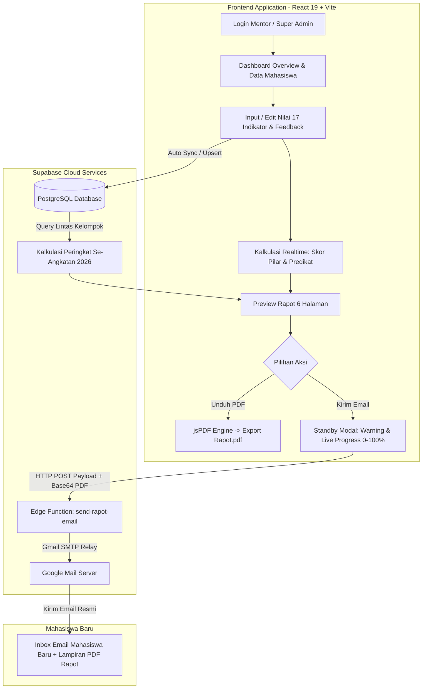

# Sistem Evaluasi & Rapot Rawat Maba (Mentoring Maba 2026)

<div align="center">


### **Departemen Human Resource Development (HRD)**
### **Himpunan Mahasiswa Sistem Informasi (HMSI) — Kabinet Pilaraksi**

[](https://react.dev/)
[](https://vitejs.dev/)
[](https://tailwindcss.com/)
[](https://supabase.com/)
[](https://github.com/parallax/jsPDF)
[](https://nodemailer.com/)

---

*Aplikasi web modern berbasis Glassmorphism untuk rekapitulasi penilaian 4 pilar mentoring mahasiswa baru 2026, kalkulasi ranking otomatis se-angkatan, generator dokumen rapot PDF 6 halaman resolusi cetak (zero cutoff), dan pengiriman langsung via email.*

</div>

---

## Daftar Isi

- [Tentang Proyek](#tentang-proyek)
- [Fitur Utama](#fitur-utama)
- [Galeri Visual Dokumen Rapot (6 Halaman)](#galeri-visual-dokumen-rapot-6-halaman)
- [Arsitektur & Alur Kerja Sistem](#arsitektur--alur-kerja-sistem)
- [Rubrik & Formula Penilaian 4 Pilar](#rubrik--formula-penilaian-4-pilar)
- [Matriks Hak Akses & Peran Pengguna](#matriks-hak-akses--peran-pengguna)
- [Teknologi yang Digunakan](#teknologi-yang-digunakan)
- [Panduan Instalasi & Menjalankan Lokal](#panduan-instalasi--menjalankan-lokal)
- [Skema Database Supabase & Migrasi](#skema-database-supabase--migrasi)
- [Konfigurasi Supabase Edge Function (Kirim Email)](#konfigurasi-supabase-edge-function-kirim-email)
- [Manajemen Jadwal Pengiriman Email](#manajemen-jadwal-pengiriman-email)
- [Struktur Direktori Repositori](#struktur-direktori-repositori)
- [FAQ & Troubleshooting](#faq--troubleshooting)
- [Kontributor & Lisensi](#kontributor--lisensi)

---

## Tentang Proyek

**Rapot Rawat Maba** adalah platform terintegrasi yang dirancang khusus oleh dan untuk Departemen HRD HMSI guna memfasilitasi Mentor Kelompok dan Koordinator Panitia dalam mengevaluasi perkembangan seluruh mahasiswa baru angkatan 2026 selama program mentoring berlangsung.

Platform ini mentransformasi seluruh proses rekapitulasi manual menjadi alur digital terpadu:
1. **Input Nilai Terstandar**: Mentor menginput skor berdasarkan 17 indikator objektif pada 4 pilar kompetensi.
2. **Kalkulasi Otomatis**: Sistem langsung mengkalkulasi skor pilar, nilai akhir, predikat kesiapan oprec, serta peringkat (`Rank #`) secara dinamis terhadap seluruh mahasiswa baru se-angkatan 2026.
3. **Penerbitan Dokumen Resmi**: Menghasilkan dokumen Rapot PDF 6 halaman berstandar A4 resolusi tinggi dengan layout visual resmi HMSI.
4. **Distribusi Satu Klik**: Pengiriman file PDF asli secara otomatis ke inbox email masing-masing mahasiswa baru menggunakan layanan serverless Supabase Edge Function & Gmail SMTP.

---

## Fitur Utama

### 1. Desain Glassmorphic Modern & Elegan
- Palet warna bernuansa Indigo & GSM Blue dengan *backdrop blur*, *subtle glowing borders*, dan transisi micro-animation yang responsif.
- Tipografi modern dan tata letak informasi yang bersih tanpa elemen visual yang berlebihan.

### 2. Dashboard Overview & Realtime KPI
- Statistik instan: Total Mahasiswa, Mahasiswa Dinilai vs Belum Dinilai, Total Kelompok, dan Progres Keseluruhan.
- **Modal Rekapitulasi Mahasiswa Pending**: Memudahkan mentor dan panitia melihat mahasiswa yang belum selesai dinilai lengkap dengan badge status keaktifan (`Active`, `Hilang`, `Pindah`, `Tidak Mengumpulkan`).
- Pencarian instan berdasarkan nama, NRP, maupun kelompok.

### 3. Formulir Penilaian 4 Pilar & 17 Indikator Terpadu
- Kontrol input nilai interaktif dengan batas validasi aman (0 – 100).
- Input feedback naratif mentor yang komprehensif:
  - **Apresiasi & Kelebihan Utama**
  - **Saran & Area Pengembangan**
  - **Rekomendasi Divisi Oprec / Kepanitiaan**
- Sinkronisasi instan ke database Supabase dengan sistem *optimistic update* dan *debounce auto-save*.

### 4. Kalkulasi Ranking Se-Angkatan 2026 (Global Rank)
- Peringkat dihitung secara transparan dan dinamis lintas seluruh kelompok angkatan 2026.
- Akun pengujian / dummy data secara otomatis dikecualikan dari perhitungan peringkat agar integritas peringkat mahasiswa tetap terjaga.

### 5. Generator Rapot PDF 6 Halaman (Zero Cutoff Engine)
- Menggunakan konversi vector canvas beresolusi tinggi (794×1123 px standard A4 @ 96-300 DPI).
- Merender 6 halaman dokumen rapot lengkap tanpa terpotong (cover, kata sambutan KAHIMA, sambutan KAWADEP & PIC, lembar nilai detail, lembar feedback, serta rekap penutup & ranking).
- Dilengkapi live progress percentage generator (0% – 100%).

### 6. Distribusi Email Otomatis & Standby Notice Modal
- Pengiriman email dengan lampiran 1 file PDF rapot asli langsung ke mahasiswa baru.
- Dilengkapi **Standby Warning Modal** dengan backdrop glassmorphic yang mengingatkan mentor untuk tetap berada di tab browser selama proses rendering PDF dan transmisi email berlangsung.
- Tampilan live progress percentage pengiriman dan tombol *"Tutup & Selesai"* setelah email sukses terkirim.

### 7. Sistem Penjadwalan Email (Super Admin Controls)
- Super Admin dapat menentukan jendela waktu aktif tombol kirim email secara global maupun override per mentor tertentu.
- Mentor mendapatkan popup notifikasi jadwal email otomatis saat login jika waktu pengiriman belum dibuka.
- Super Admin memiliki hak bypass penuh untuk pengujian kapan saja.

### 8. Akun Dummy Khusus Super Admin
- Record mahasiswa khusus (`NRP: 5026249999`) untuk uji coba input nilai, ekspor PDF, dan uji kirim email tanpa mengotori data mahasiswa asli.
- Terisolasi sepenuhnya dari pandangan mentor kelompok biasa.

### 9. Sesi Ketat 1x24 Jam (Watchdog Interval)
- Keamanan sesi login dengan masa berlaku 1x24 jam.
- Dilengkapi background heartbeat watchdog yang memeriksa keabsahan timestamp `expiresAt` secara realtime dan otomatis melakukan logout jika sesi telah habis.

---

## Galeri Visual Dokumen Rapot (6 Halaman)

Dokumen rapot yang dihasilkan tersusun atas 6 halaman A4 portrait berurutan dengan desain visual resmi HRD HMSI:

| Halaman 1 — Cover Dokumen | Halaman 2 — Sambutan KAHIMA | Halaman 3 — Sambutan HRD & PIC |
| :---: | :---: | :---: |
|  |  |  |
| *Identitas Mahasiswa, NRP, Kelompok & Mentor* | *Pesan & Harapan Ketua Himpunan HMSI* | *Pesan dari Kadep HRD & PIC Rawat Maba* |

| Halaman 4 — Detail Nilai 4 Pilar | Halaman 5 — Feedback Mentor | Halaman 6 — Rekap Penutup & Rank |
| :---: | :---: | :---: |
|  |  |  |
| *Rincian Skor 17 Indikator Terstandar* | *Apresiasi, Saran & Rekomendasi Oprec* | *Nilai Akhir, Predikat & Peringkat Se-Angkatan* |

---

## Arsitektur & Alur Kerja Sistem



---

## Rubrik & Formula Penilaian 4 Pilar

Sistem penilaian menggunakan pembobotan terstandarisasi untuk menjamin objektivitas evaluasi:

```
Nilai Akhir = (Skor Pilar 1 × 25%) + (Skor Pilar 2 × 25%) + (Skor Pilar 3 × 30%) + (Skor Pilar 4 × 20%)
```

### Rincian 17 Indikator Penilaian:

| Pilar | Bobot | Indikator Penilaian | Aspek Pengujian |
| :--- | :---: | :--- | :--- |
| **Pilar 1: Curriculumn Vitae (CV)** | **25%** | 1. Struktur & Format ATS/Kreatif<br>2. Kelengkapan Identitas & Riwayat<br>3. Relevansi Pengalaman & Target Divisi<br>4. Kualitas Bahasa & Deskripsi Aksi (Action Verbs)<br>5. Kerapian Visual & Tipografi | Menilai kesiapan dokumen profesional CV mahasiswa baru untuk seleksi kepanitiaan/organisasi. |
| **Pilar 2: Profil LinkedIn** | **25%** | 1. Kelengkapan Foto, Banner & Headline<br>2. Personal Branding & About Section<br>3. Sinkronisasi Data dengan CV | Mengukur keberadaan digital profesional dan branding di platform jejaring kerja. |
| **Pilar 3: Simulasi Interview** | **30%** | 1. Struktur Jawaban Metode STAR<br>2. Artikulasi & Komunikasi Verbal/Non-verbal<br>3. Kepercayaan Diri & Sikap Profesional<br>4. Relevansi Jawaban dengan Divisi Impian<br>5. Kemampuan Problem Solving / Pertanyaan Studi Kasus | Menguji kesiapan mental, pemahaman diri, dan kemampuan artikulasi saat wawancara. |
| **Pilar 4: Keaktifan & Penugasan** | **20%** | 1. Kehadiran & Partisipasi Sesi Mentoring<br>2. Ketepatan Waktu Pengumpulan Tugas<br>3. Kerjasama & Kolaborasi Kelompok<br>4. Respon & Keterbukaan terhadap Masukan Mentor | Mengukur attitude, inisiatif, komitmen waktu, dan etika kerja sama. |

### Klasifikasi Predikat Kesiapan:

| Rentang Skor | Predikat | Keterangan & Rekomendasi |
| :---: | :---: | :--- |
| **90.0 – 100.0** | `Sangat Siap Oprec` | Mahasiswa sangat siap berkompetisi dan direkomendasikan memegang peran strategis/kunci. |
| **75.0 – 89.9** | `Siap Oprec` | Memenuhi seluruh standar kompetensi dasar untuk lolos seleksi kepanitiaan/divisi. |
| **60.0 – 74.9** | `Cukup Siap` | Memiliki potensi baik namun membutuhkan latihan lanjutan pada pilar tertentu. |
| **< 60.0** | `Perlu Pendampingan Khusus` | Membutuhkan asistensi lebih intensif dari mentor dalam persiapan berkas & interview. |

---

## Matriks Hak Akses & Peran Pengguna

| Fitur / Kemampuan | Super Admin (`webdev`) | Mentor Kelompok |
| :--- | :---: | :---: |
| **Melihat & Menilai Seluruh Mahasiswa** | Ya (Semua Kelompok) | Hanya Kelompok Sendiri |
| **Akses Akun Dummy Pengujian (`NRP 5026249999`)** | Ya | Tersembunyi |
| **Atur Jadwal Pengiriman Email (Global & Per Mentor)** | Ya | Tidak |
| **Bypass Jadwal Email (Kirim Kapan Saja)** | Ya | Mengikuti Jadwal |
| **Popup Pengingat Jadwal Saat Login** | Tidak | Ya (Otomatis) |
| **Ubah Profil & Nama Mentor** | Ya | Ya |
| **Unduh PDF & Kirim Email Rapot** | Ya | Ya (Sesuai Jadwal) |

---

## Teknologi yang Digunakan

### Frontend
- **Framework**: [React 19.2](https://react.dev/) + [Vite 6.4](https://vitejs.dev/)
- **Styling**: [Tailwind CSS 3.4](https://tailwindcss.com/) dengan Glassmorphic Design System
- **PDF Engine**: [jsPDF](https://github.com/parallax/jsPDF) & [html-to-image](https://github.com/bubkoo/html-to-image)
- **Icons**: [Lucide React](https://lucide.dev/) & [Google Material Symbols](https://fonts.google.com/icons)

### Backend & Cloud Infrastructure
- **Database**: [Supabase PostgreSQL](https://supabase.com/) dengan Realtime Data Layer
- **Serverless Compute**: [Supabase Edge Functions](https://supabase.com/docs/guides/functions) (Deno Runtime)
- **Email Dispatcher**: [Nodemailer](https://nodemailer.com/) via Gmail SMTP Relay

---

## Panduan Instalasi & Menjalankan Lokal

### 1. Prasyarat Sistem
Pastikan perangkat Anda telah terinstall:
- [Node.js](https://nodejs.org/) (Versi 18.x atau lebih baru)
- [npm](https://www.npmjs.com/) atau `yarn` / `pnpm`
- [Supabase CLI](https://supabase.com/docs/guides/cli) *(opsional untuk deploy edge functions)*

### 2. Clone Repositori
```bash
git clone https://github.com/your-username/rapot-rawat-maba.git
cd rapot-rawat-maba
```

### 3. Install Dependensi
```bash
npm install
```

### 4. Konfigurasi Environment Variables
Salin template `.env.example` menjadi `.env` di direktori utama:
```bash
cp .env.example .env
```
Isi konfigurasi kunci Supabase Anda pada file `.env`:
```env
VITE_SUPABASE_URL=https://your-project-id.supabase.co
VITE_SUPABASE_ANON_KEY=eyJhbGciOiJIUzI1NiIsInR5cCI6IkpXVCJ9...
```

### 5. Jalankan Aplikasi di Lingkungan Pengembangan
```bash
npm run dev
```
Aplikasi akan aktif dan dapat diakses melalui browser di `http://localhost:5173`.

### 6. Build untuk Lingkungan Produksi
```bash
npm run build
npm run preview
```

---

## Skema Database Supabase & Migrasi

Jalankan script SQL migrasi yang tersedia di folder `supabase/migrations/` pada **Supabase SQL Editor**:

1. **`add_student_status.sql`**: Menambahkan kolom status keaktifan mahasiswa (`Active`, `Hilang`, `Pindah`, `Tidak Mengumpulkan`).
2. **`add_dummy_student_and_email_schedules.sql`**: Membuat tabel `email_schedules`, mendaftarkan mahasiswa dummy Super Admin, dan relasi nilai awal.

### Struktur Tabel Utama:
- `students`: Data mahasiswa baru (`id`, `nrp`, `name`, `email`, `department`, `group_id`, `student_status`, dll).
- `mentors`: Data profil mentor bimbingan.
- `mentoring_groups`: Daftar kelompok bimbingan dan alokasi ruangan.
- `rapot_evaluations`: Data skor 17 indikator, total nilai pilar, nilai akhir, predikat, dan teks feedback mentor.
- `email_schedules`: Konfigurasi jadwal rilis tombol kirim email (global & per mentor).
- `profiles`: Data autentikasi & role akun (`super_admin`, `mentor`).

---

## Konfigurasi Supabase Edge Function (Kirim Email)

Fungsi `send-rapot-email` bertanggung jawab menerima payload dokumen PDF dari client dan mengirimkannya ke email mahasiswa via Gmail SMTP.

### 1. Buat Google App Password
1. Buka akun Google pengirim (misal: email resmi panitia).
2. Masuk ke menu **Security (Keamanan)** > Aktifkan **2-Step Verification**.
3. Buka menu **App passwords (Sandi aplikasi)**.
4. Buat sandi baru (beri nama *Rapot Rawat Maba*), lalu salin 16 karakter kode sandi yang diberikan.

### 2. Set Secrets di Supabase
Atur variabel rahasia pada Supabase Cloud melalui CLI atau Dashboard (**Settings > Edge Functions > Secrets**):
```bash
npx supabase secrets set GMAIL_USER="email.panitia@gmail.com" GMAIL_APP_PASS="xxxx xxxx xxxx xxxx" --project-ref your-project-ref
```

### 3. Deploy Edge Function
```bash
npx supabase functions deploy send-rapot-email --project-ref your-project-ref
```

---

## Manajemen Jadwal Pengiriman Email

Untuk mencegah email terkirim sebelum seluruh penilaian tuntas, Super Admin dapat mengelola jadwal pengiriman melalui menu **Jadwal Pengiriman Email** (ikon jam di profil):

1. **Jadwal Global**:
   - Tentukan `Tanggal Mulai`, `Jam Mulai (WIB)`, `Tanggal Berakhir`, dan `Jam Berakhir (WIB)`.
   - Mengontrol tombol kirim email seluruh mentor secara serentak.
2. **Mode Khusus Per Mentor**:
   - `Ikuti Jadwal Global`: Default, tunduk pada jadwal global.
   - `Selalu Aktif (Bypass)`: Tombol kirim email mentor ini selalu aktif tanpa batas waktu.
   - `Nonaktifkan Sementara`: Tombol dinonaktifkan sementara untuk mentor bersangkutan.
   - `Jadwal Khusus`: Memberikan jendela waktu spesifik yang berbeda dari kelompok lain.

---

## Struktur Direktori Repositori

```
rapot-rawat-maba/
├── public/
│   ├── assets/
│   │   ├── Rapot/                # Template visual 6 halaman A4 rapot
│   │   │   ├── 1 - COVER.png
│   │   │   ├── 2 - Pesan dari KAHIMA.png
│   │   │   ├── 3. Pesan dri Kawadep HRD dan PIC.png
│   │   │   ├── 4 - Nilai Peserta.png
│   │   │   ├── 5 - Feedback dari mentor.png
│   │   │   └── 6 - Closing.png
│   │   ├── Logo HRD.png          # Logo resmi Departemen HRD HMSI
│   │   └── BG1.png, BG4.svg      # Aset latar belakang ambient
├── src/
│   ├── components/
│   │   ├── EditProfileModal.jsx          # Modal edit nama dan profil mentor
│   │   ├── EmailScheduleModal.jsx        # Modal pengaturan jadwal email (Super Admin)
│   │   ├── GeneratePdfModal.jsx          # Preview rapot, rendering PDF, & email sender
│   │   ├── Header.jsx                    # Navigasi atas & dropdown profil
│   │   ├── InsertGradesModal.jsx         # Formulir input nilai 17 indikator & 4 pilar
│   │   ├── MentorScheduleNoticeModal.jsx # Popup jadwal email mentor saat login
│   │   ├── OverviewDashboard.jsx         # KPI statistik & modal mahasiswa pending
│   │   └── StudentsView.jsx              # Daftar card & tabel data mahasiswa
│   ├── lib/
│   │   ├── dataService.js                # Layanan query Supabase, kalkulasi ranking & sync
│   │   └── supabase.js                   # Client Supabase SDK initialization
│   ├── data/
│   │   └── mockData.js                   # Data fallback & definisi konstanta rubrik
│   ├── App.jsx                           # Controller aplikasi utama & watchdog sesi 24 jam
│   ├── index.css                         # Tailwind CSS imports & custom glassmorphism
│   └── main.jsx                          # React DOM entrypoint
├── supabase/
│   ├── functions/
│   │   └── send-rapot-email/             # Edge Function TypeScript (Nodemailer)
│   └── migrations/                       # Script SQL migrasi skema database
├── .env.example                          # Template konfigurasi environment
├── package.json
└── README.md
```

---

## FAQ & Troubleshooting

<details>
<summary><b>1. Mengapa proses pengiriman email berhenti saat saya berpindah tab / aplikasi?</b></summary>
<p>
Browser modern menghemat daya dengan melakukan <i>throttling</i> (pembatasan) rendering DOM dan <code>requestAnimationFrame</code> pada tab latar belakang. Oleh karena itu, aplikasi menampilkan pop-up standby notice yang menganjurkan Anda untuk tetap membuka tab aktif hingga indikator proses mencapai 100% dan status berubah menjadi <i>"Terkirim"</i>.
</p>
</details>

<details>
<summary><b>2. Bagaimana peringkat mahasiswa (#Rank) dihitung?</b></summary>
<p>
Peringkat dihitung secara global terhadap seluruh mahasiswa baru angkatan 2026 berdasarkan total <b>Nilai Akhir</b> tertinggi ke terendah. Mahasiswa dummy pengujian secara otomatis dikecualikan dari kalkulasi agar data ranking tetap akurat.
</p>
</details>

<details>
<summary><b>3. Mengapa tombol kirim email terkunci / dinonaktifkan?</b></summary>
<p>
Tombol dinonaktifkan jika waktu pengiriman belum memasuki rentang jadwal aktif yang ditentukan oleh Super Admin, atau jika mahasiswa belum memiliki evaluasi nilai yang lengkap.
</p>
</details>

---

## Kontributor & Lisensi

Dikembangkan untuk kesuksesan kaderisasi mahasiswa baru **Departemen Human Resource Development (HRD)**, **Himpunan Mahasiswa Sistem Informasi (HMSI)** Kabinet Pilaraksi, Institut Teknologi Sepuluh Nopember (ITS).

© 2026 **Departemen HRD HMSI**. All rights reserved.
